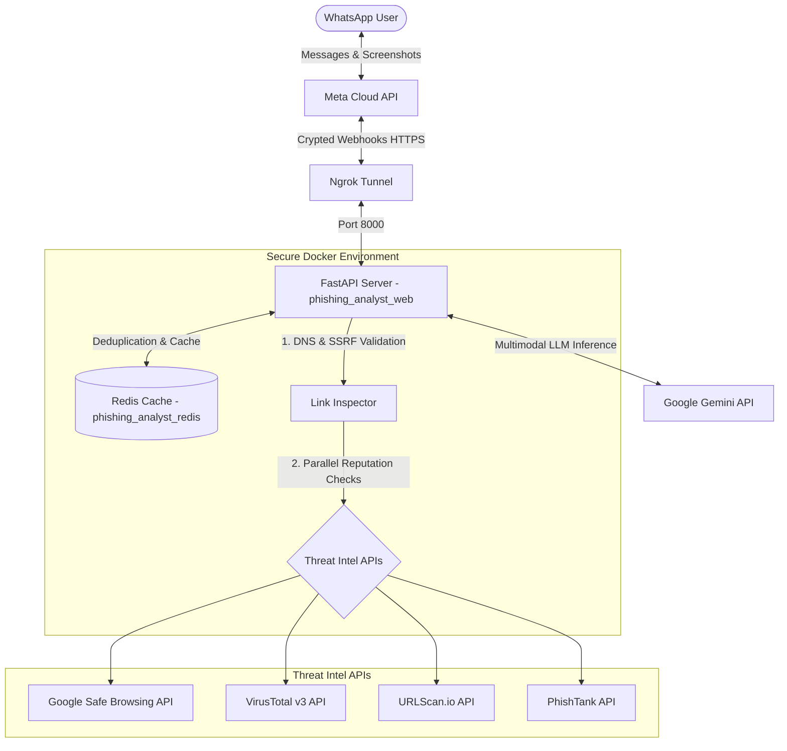

# Phishing Analyst Agent 🛡️💬
*An Intelligent Multimodal WhatsApp Bot for Real-Time Phishing and Social Engineering Analysis.*

---

## 📌 Project Overview
**Phishing Analyst Agent** is a state-of-the-art, secure-by-design conversational assistant integrated into WhatsApp. It is designed to act as a personal, family-friendly cybersecurity analyst that empowers non-technical users to verify the safety of suspicious messages, links, and screenshots in real-time.

Built using **FastAPI**, **Docker**, and **Redis**, the agent leverages a hybrid analysis pipeline:
1. **Multimodal Vision Analysis (Screenshots):** Using **Google Gemini**, it inspects screenshot uploads of emails, banking screens, or SMS messages to visually identify spoofed brand logos, psychological manipulation techniques (urgency, panic, greed), and text-based threat indicators.
2. **Multi-Layered Threat Intelligence (URLs & Texts):** It extracts links, runs rigorous local network mitigations against **SSRF and DNS Rebinding** attacks, queries multiple reputational engines (**Google Safe Browsing, VirusTotal, URLScan.io, PhishTank**) in parallel, and delivers warm, easy-to-understand safety summaries back to the user on WhatsApp.

---

## 🏗️ System Architecture



---

## 🔒 Advanced Cybersecurity Controls (Security-by-Design)

### 1. SSRF & DNS Rebinding Defenses
Analyzing untrusted URLs provided by users exposes the host to server-side attacks. This project implements advanced defensive measures in `app/security/link_inspector.py`:
* **Unicode NFC Normalization:** Normalizes input strings to neutralize character homograph attacks and bypasses.
* **Dual-Stack DNS Resolution & IP Blacklisting:** Explicitly resolves the target host using `socket.getaddrinfo` and inspects the IP addresses. It blocks loopback (`127.0.0.1`, `::1`), private ranges (RFC 1918), CGNAT (`100.64.0.0/10`), NAT64 (`64:ff9b::/96`), and 6to4 (`2002::/16`) to mitigate **Server-Side Request Forgery (SSRF)**.
* **Anti-DNS Rebinding (Direct IP Binding):** To prevent DNS records from being modified during verification hops, the HTTP client connects directly to the **previously validated IP address**. The original domain name is manually injected into the `Host` header and the TLS SNI (`sni_hostname`) field to preserve SSL/TLS integrity.
* **Manual Redirection Tracking:** Set to `follow_redirects=False`. Redirects are manually followed for up to 5 hops, validating DNS and IP safety at each step to catch attackers attempting to redirect users from a benign domain to a malicious one.

### 2. Webhook Signature Verification (HMAC-SHA256)
To secure the `/webhook` entry point from payload spoofing:
* Every incoming POST request from Meta is cryptographically validated using the `X-Hub-Signature-256` header.
* The server calculates a local SHA-256 HMAC of the raw request body using the private `META_APP_SECRET`.
* The signatures are compared using `secrets.compare_digest` to prevent **timing-based side-channel attacks**.

### 3. Event Deduplication & Replay Mitigation
Meta's Cloud API retries webhooks if the backend doesn't respond instantly. To avoid duplicate processing, database lockups, and replay attacks:
* A Redis-based deduplicator extracts the unique `message_id` and caches it with a short-term TTL.
* Duplicate incoming calls are instantly dropped with an HTTP `200 OK` response without triggering background processing tasks.

### 4. Container Hardening (Least Privilege)
* The application runs inside a lightweight `python:3.11-slim` container.
* In the `Dockerfile`, a non-root system group (`appgroup` GID 10001) and user (`appuser` UID 10001) are created. The application executes under `USER appuser`, strictly preventing container escape attacks from granting host-root access.
* Network ports for critical database components (Redis) are bound strictly to `127.0.0.1` inside `docker-compose.yml` to prevent public scanning.

---

## 🛠️ Technology Stack
* **Framework:** FastAPI, Uvicorn, Pydantic v2
* **Storage & Caching:** Redis 7 (Alpine-based container)
* **AI Model Engine:** Google GenAI SDK (Gemini 2.5 Flash / 3.5 Flash)
* **Deployment:** Docker & Docker Compose
* **Network Exposure:** Ngrok Tunneling

---

## ⚙️ Configuration & Environment Setup

Create a `.env` file in the root directory of the project using the template below. **Do not commit this file to public repositories.**

```ini
# Meta / WhatsApp Cloud API Credentials
WHATSAPP_VERIFY_TOKEN=your_invented_webhook_verify_token
META_APP_SECRET=your_meta_developer_app_secret
META_API_VERSION=v21.0
WHATSAPP_PHONE_NUMBER_ID=your_whatsapp_test_phone_number_id
META_ACCESS_TOKEN=your_meta_permanent_system_user_access_token

# Gemini AI Configuration
GEMINI_API_KEY=your_google_ai_studio_api_key
GEMINI_MODEL=gemini-2.5-flash

# External Security APIs for Phishing Analysis
SAFE_BROWSING_API_KEY=your_google_cloud_safe_browsing_api_key
VIRUSTOTAL_API_KEY=your_virustotal_api_key
URLSCAN_API_KEY=your_urlscan_api_key
PHISHTANK_API_KEY=your_phishtank_api_key
PHISHTANK_USER_NAME=your_phishtank_user_name

# Redis Configuration (Defaults match docker-compose.yml configuration)
REDIS_HOST=redis
REDIS_PORT=6379
REDIS_DB=0

# Ngrok Configuration (For automated reverse proxy tunnel inside Docker Compose)
NGROK_AUTHTOKEN=your_ngrok_authtoken_here
NGROK_SUBDOMAIN=your-registered-subdomain.ngrok-free.dev
```

---

## 🚀 Installation & Running Locally

### 1. Build and Launch all Services
Launch the FastAPI application, the secure Redis instance, and the Ngrok tunnel in a single command:
```bash
docker compose up --build
```
This builds the non-root FastAPI environment, configures Uvicorn on port `8000` (accessible securely inside the container network), and spins up the automated Ngrok reverse proxy tunnel pointing directly to your registered subdomain.

### 3. Connect the Webhook in Meta Developers Portal
1. Navigate to your app in **developers.facebook.com** -> **Use cases** -> **Connect with clients through WhatsApp** -> **Customize** -> **Basic Settings** -> **Step 2. Settings for prod**.
2. Click **Set webhooks** and input your tunnel configurations:
   * **Callback URL:** `https://your-registered-subdomain.ngrok-free.dev/webhook`
   * **Verification Token:** (Must match `WHATSAPP_VERIFY_TOKEN` in your `.env`)
3. Under Webhook Fields, **unsubscribe from everything except `messages`** and save.
4. Finally, subscribe your app to the WABA by executing the following curl command in a terminal:
```bash
curl -i -X POST "https://graph.facebook.com/v21.0/{YOUR_WABA_ID}/subscribed_apps?subscribed_fields=messages" \
     -H "Authorization: Bearer {YOUR_META_ACCESS_TOKEN}"
```

---

## 📱 Usage & Testing

Once running, send a message to your WhatsApp test number from an authorized test phone:

### Test Case A: Text Analysis with Suspicious Links
Send a typical SMS bank alert text containing a domain:
> *"Dear customer, your bank account has been locked. Verify your credentials immediately: https://rebrand.ly/fake-bank-update"*

* **What happens:** The system extracts the link, intercepts and resolves DNS safely (blocking local subnets), queries Safe Browsing, VirusTotal, URLScan, and PhishTank in parallel, and returns a detailed security verdict with visual indicators (🔴 Dangerous, 🟡 Suspicious, 🟢 Safe) in clear, warm Spanish.

### Test Case B: Visual Phishing Analysis (Screenshots)
Send a screenshot of a suspicious web portal, credit card entry screen, or urgent message.
* **What happens:** The backend downloads the media stream (safely checking file size under 7MB), downscales it to 1200px to optimize API latencies, and feeds it into Gemini Vision. The user receives a conversational assessment explaining brand spoofing, psychological manipulation triggers, and recommendations to prevent fraud.

---

## 📄 License & Academic Disclaimer
This project is licensed under the MIT License. 

*Disclaimer: This repository was developed as an academic project for a Cybersecurity University Course. It is intended for educational purposes and local development environments only. Use responsibly when testing live endpoints.*